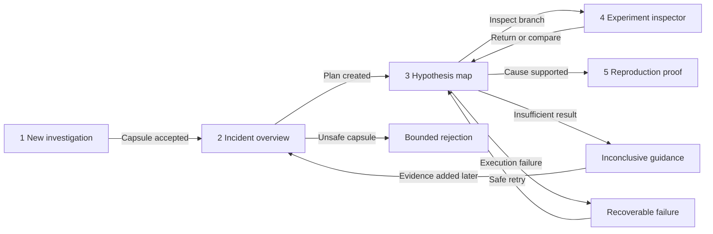

# Interaction and Visual Foundations

**Status:** Defined for Gate G3.1 review

**Definition date:** 2026-09-11

## Outcome

The Scully interface is organized around five engineering questions. Each
screen advances one investigation state and exposes the evidence needed to
challenge its claims. Status is communicated through text, shape, icon, and
placement. Color is supportive and never the only signal.

This foundation defines the experience contract for Steps 3.2 through 3.4. It
does not activate live providers or expand the execution authority proven in
Phase 2.

## Five-screen information architecture

| Screen | Primary engineering question | Required answer | Primary action |
|---|---|---|---|
| 1. New investigation | What evidence will enter, and is it safe? | Included and excluded files, scan outcome, redaction state, signature, and production-access boundary | Validate capsule |
| 2. Incident overview | What do we know happened? | Observed signature, environment delta, timeline, facts, missing evidence, and lineage | Create investigation |
| 3. Hypothesis map | What is suspected, tested, eliminated, or reproduced? | Common checkpoint, competing branches, current status, prediction, and elimination reason | Run or inspect branch |
| 4. Experiment inspector | What exactly happened in this branch? | Input and environment diff, bounded operations, output, matcher results, and source evidence | Return to map or compare |
| 5. Reproduction proof | What can another engineer run and verify? | Original and reproduced signatures, supported cause, minimal delta, failing test, instructions, export, and limitations | Download reproduction |

The active investigation identity, local or provider mode, and current state
remain visible in the application frame. Screen-local actions stay inside the
screen content rather than in global navigation.

### Planned route model

```text
/new
/investigations/{id}/overview
/investigations/{id}/hypotheses
/investigations/{id}/experiments/{experiment_id}
/investigations/{id}/proof
```

The browser history must preserve the selected investigation and branch. A
reload on any investigation route must reconstruct the view from persisted
state. An unavailable or unauthorized future action must be absent or labeled
unavailable, never presented as an inert control.

## Primary navigation flow



The main path reads left to right on wide screens and top to bottom on narrow
screens. The experiment inspector is a focused branch view, not an additional
required step in the happy path.

## Evidence-state system

| State | Text label | Symbol | Structural treatment | Semantic color token |
|---|---|---:|---|---|
| Observed | `Observed` | ● | Solid source rail and evidence link | `--state-observed` |
| Inferred | `Hypothesis` | ◇ | Dashed top rail and stated prediction | `--state-inferred` |
| Testing | `Testing` | ▶ | Live event row and operation count | `--state-testing` |
| Eliminated | `Eliminated` | × | Muted card and explicit elimination reason | `--state-eliminated` |
| Reproduced | `Reproduced` | ✓ | Strong result rail and proof link | `--state-reproduced` |
| Inconclusive | `Inconclusive` | ? | Outlined card and required-next-evidence text | `--state-inconclusive` |

Every state instance must include its visible text label. Symbols must include
screen-reader text when the adjacent label is not sufficient. Reproduced and
supported are distinct concepts: a branch can reproduce the incident while its
intervention hypothesis is eliminated. The UI must state both outcomes.

Confidence is supplementary hypothesis metadata. It cannot replace any state
label or experimental result.

## Visual tokens

### Color

| Token | Value | Use |
|---|---|---|
| `--surface-canvas` | `#07100d` | Application background |
| `--surface-panel` | `#0c1914` | Primary panels |
| `--surface-raised` | `#12221b` | Inspector and focused content |
| `--text-primary` | `#eef3ef` | Body and heading text |
| `--text-secondary` | `#a5b0aa` | Supporting text |
| `--state-observed` | `#7db7ff` | Direct evidence |
| `--state-inferred` | `#e7c26a` | Untested hypotheses |
| `--state-testing` | `#77f2bf` | Active execution |
| `--state-eliminated` | `#b1bab5` | Eliminated branches |
| `--state-reproduced` | `#77f2bf` | Reproduced proof |
| `--state-inconclusive` | `#f0a562` | Incomplete evidence or result |
| `--focus-ring` | `#7db7ff` | Keyboard focus indicator |

Primary and secondary text, plus every state color, exceed a 4.5:1 contrast
ratio on the canvas. Text placed on a different surface must be tested again in
the implemented component. State colors are never used as filled button
backgrounds without a separate foreground contrast check.

Essential control boundaries, status rails, focus indicators, and standalone
symbols must maintain at least 3:1 contrast against adjacent surfaces.

### Typography

- Interface and narrative text: `Inter`, with the system sans-serif stack as
  fallback.
- Evidence, identifiers, commands, signatures, and measured values: `IBM Plex
  Mono`, with the system monospace stack as fallback.
- Base size: 16 px.
- Supporting text floor: 13 px on desktop and mobile.
- Body line height: 1.5. Evidence line height: 1.45.
- Headings use weight and spacing rather than all-capital words.

External font delivery is optional. The application must remain legible and
stable with only its fallback stacks.

### Spacing and shape

- Base spacing unit: 4 px.
- Supported spacing scale: 4, 8, 12, 16, 24, 32, 48, and 64 px.
- Dense evidence rows use at least 12 px internal spacing.
- Primary panels use 16 px corners. Controls use 8 px corners.
- Status rails are 3 px and always paired with a state label and symbol.
- Content width is capped at 1,280 px, with no horizontal page scrolling at
  360 px viewport width.

### Motion

- Fast feedback: 120 ms.
- State transition: 180 ms.
- Branch insertion or expansion: 240 ms.
- Allowed properties: opacity, color, and transform.
- No navigation or action waits for animation to complete.
- The only continuous motion is the testing-state pulse, and it stops at a
  terminal event.
- With reduced motion enabled, the pulse becomes a static testing symbol and
  all spatial transitions become immediate. No information is lost.

## Investigation-state flows

### New

```text
Empty capsule target
  -> file selected or safe seed selected
  -> validating with visible checklist
  -> accepted manifest review
  -> explicit start action
```

The start action stays unavailable until schema validation, secret scanning,
hash verification, and signature validation succeed. Rejection keeps the
bounded reason and a clear path to select another capsule.

### Active

```text
Observed facts loaded
  -> hypotheses planned
  -> clean checkpoint shown
  -> branches enter Testing independently
  -> each event updates its named branch
  -> evaluator assigns a terminal state
```

The interface must continue to show completed siblings while another branch is
active. The latest event is announced politely and remains available in the
timeline. Decorative animation cannot obscure or reorder events.

### Failed

```text
Branch or service failure
  -> affected scope labeled Failed
  -> safe reason code and retained evidence shown
  -> completed sibling results preserved
  -> retry offered only when the operation is idempotent and supported
```

The screen never suggests that a failed branch proves or eliminates a
hypothesis. A global failure and a single-branch failure use different headings
and recovery actions.

### Inconclusive

```text
Evaluation lacks required evidence
  -> branch labeled Inconclusive
  -> missing matcher or evidence named
  -> required next evidence listed
  -> existing observations remain available
```

Inconclusive is a terminal result for the current evidence, not an error. It
must not use the failure treatment or imply that retrying unchanged inputs will
help.

### Completed

```text
One cause supported
  -> original and reproduced signatures compared
  -> minimal causal delta stated
  -> lineage remains inspectable
  -> reproduction download enabled
  -> limitations remain adjacent to the claim
```

If no single cause is supported, navigation ends at the hypothesis map with an
inconclusive result. The proof screen is not shown as a successful destination.

## Keyboard and assistive-technology requirements

1. A skip link moves focus directly to the active screen heading.
2. Global navigation precedes screen content in source and focus order.
3. Every action is reachable and operable with keyboard alone.
4. Focus uses a persistent 3 px ring with at least 2 px visual separation from
   the component boundary.
5. Interactive targets are at least 44 by 44 CSS pixels unless an inline text
   link has sufficient surrounding separation.
6. Branch cards are not made clickable as a whole. They contain a named
   **Inspect branch** link or button.
7. The current navigation item uses `aria-current="page"`.
8. Live progress uses a polite status region. A blocking fatal error uses an
   assertive alert. Persisted event history is not repeatedly announced.
9. Focus moves to the screen heading after route navigation and to the error
   summary after a rejected submit.
10. Dialogs, if introduced later, must trap focus while open, close with Escape,
    and restore focus to their invoking control.
11. Tables retain real row and column headers. Diffs provide a linear text
    alternative.
12. At 200 percent zoom and 360 px width, content reflows without loss of
    actions, evidence labels, or status meaning.

## Responsive foundation

- At 1,024 px and wider, the investigation steps appear as a compact persistent
  rail beside the active screen.
- Below 1,024 px, the rail becomes a horizontal named progress list above the
  screen heading.
- Below 720 px, secondary metadata stacks beneath primary content, while state
  labels and actions retain their text.
- The hypothesis map becomes a vertical ordered branch list on narrow screens.
  It does not shrink into an unreadable graph.
- The experiment inspector presents diffs sequentially on narrow screens and
  side by side only when both panes remain readable.

## Implementation acceptance checklist

- Each screen has one visible question and one primary action.
- Observed, hypothesis, testing, eliminated, reproduced, and inconclusive
  states pass a monochrome inspection.
- The primary flow is complete with all animations disabled.
- Focus order follows the visual order at desktop and mobile widths.
- No terminal state depends on confidence or model-authored verdict text.
- Missing evidence and limitations remain adjacent to the affected claim.
- A screen reader can identify the current screen, current branch, and latest
  execution state without reading the entire timeline.
- All user-visible provider actions remain disabled until separately approved.
