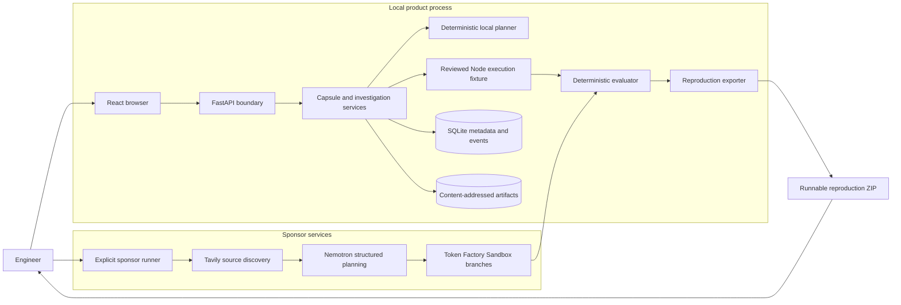
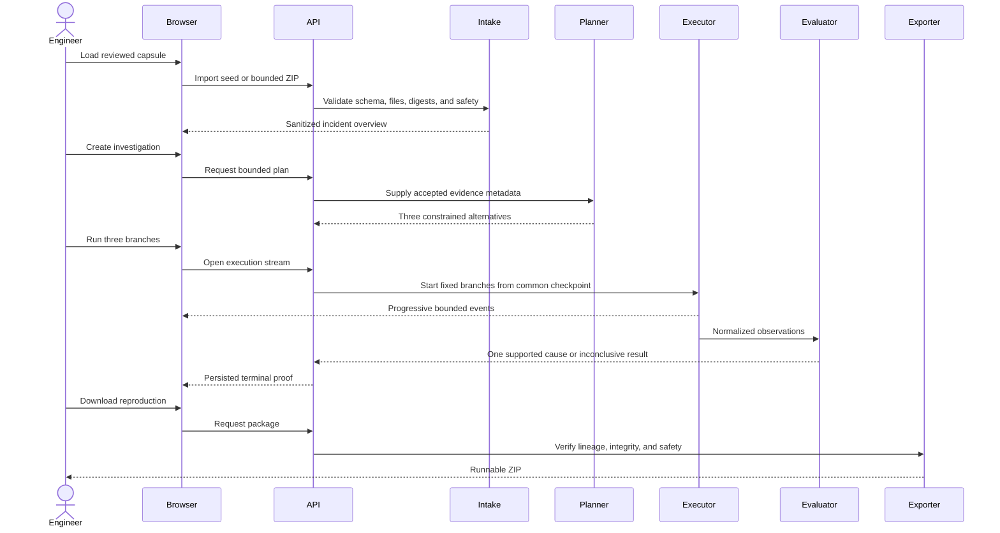
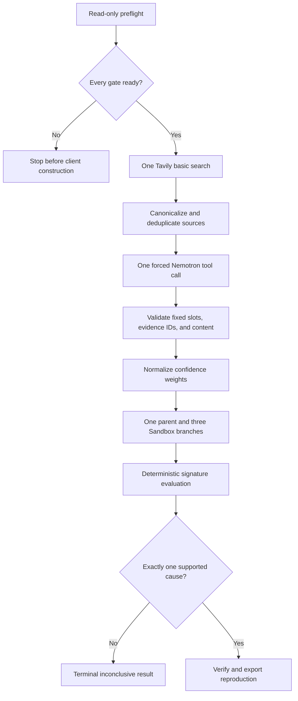
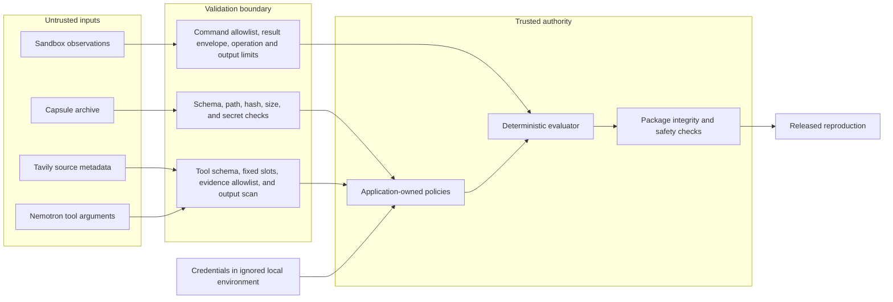

# Release Architecture

**Status:** Approved at Gate G4.5

**Version:** `0.1.0-rc1`

## Runtime shape

Scully has two controlled entry points over shared contracts:

1. The browser product uses deterministic local planning and a reviewed local
   execution fixture. It requires no provider credential and is the reliable
   demonstration path.
2. The sponsor runner uses Tavily for source discovery, Nemotron for structured
   planning, and Token Factory Sandboxes for isolated branches. It is disabled
   by default and requires an exact approved run identifier plus manual cost
   confirmations.

Both paths end at the same deterministic evaluator and reproduction exporter.
Neither provider can decide that a cause is supported or that a reproduction
is valid.

## Component architecture

## Product data flow

## Sponsor data flow

Every provider stage has a fixed request or operation cap, a 60-second timeout,
and zero application retries. A failure ends the run and requires a new reviewed
identifier.

## Trust and threat boundaries

The browser never receives provider credentials. Capsule data, public-source
metadata, model output, and Sandbox output remain untrusted until their local
contracts pass. Only application-owned code selects commands, maps variants,
evaluates matchers, and releases a package.

## Persistence and recovery

- SQLite stores normalized investigation state and ordered audit events.
- Evidence files use content hashes under ignored local storage.
- Streaming progress is delivered during local execution, while the persisted
  event endpoint remains available for audit replay.
- Terminal investigations cannot be rewritten or resumed.
- Recovery starts a new investigation after the cause of failure is reviewed.
- Provider execution results are retained only as bounded measurement and
  evidence records approved for the repository.

## Release deployment boundary

The release candidate is a local single-user product. FastAPI serves the built
frontend from one process, and the demonstration runs on loopback. Public
hosting, remote user data, and production credentials are not required for the
submission proof and remain outside the frozen scope.
